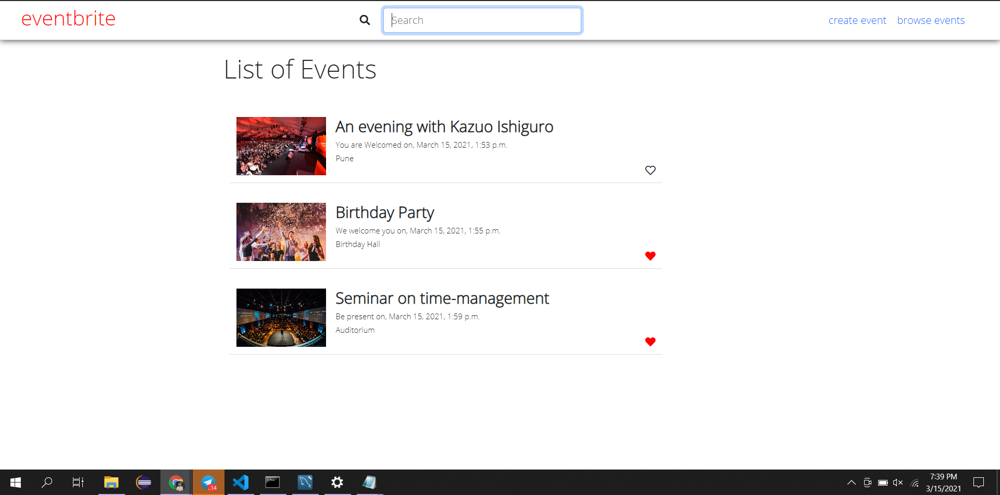
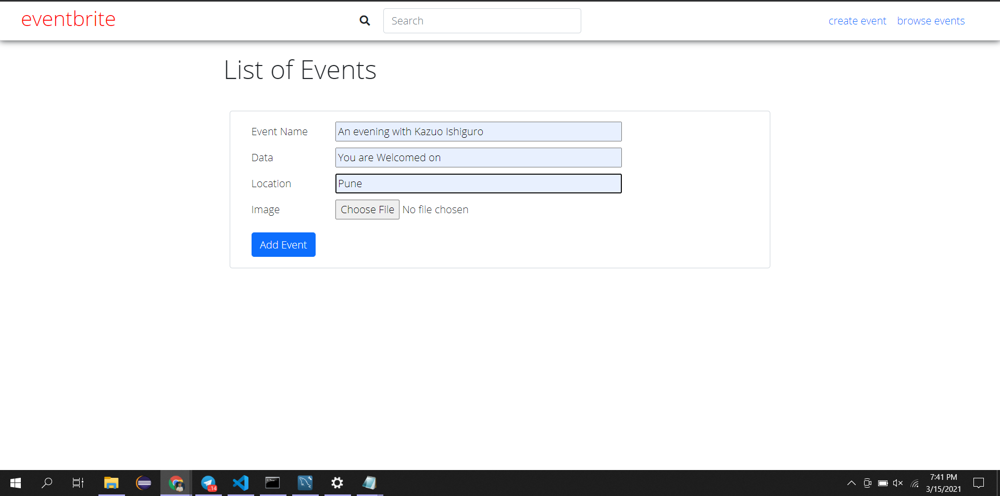

# Event_Manager
A dyanamic webpage in django.

A dynamic webpage in django.Used mysql database for backend. Users should be able to like and unlike the event by clicking on the ‘heart’ symbol.
Users should be able to add new events. Event name, date, time, location and image.

## Screenshots

## Features

- User can create events.
- All the created events can be seen and liked.
- Liked events can be sorted accordingly.
